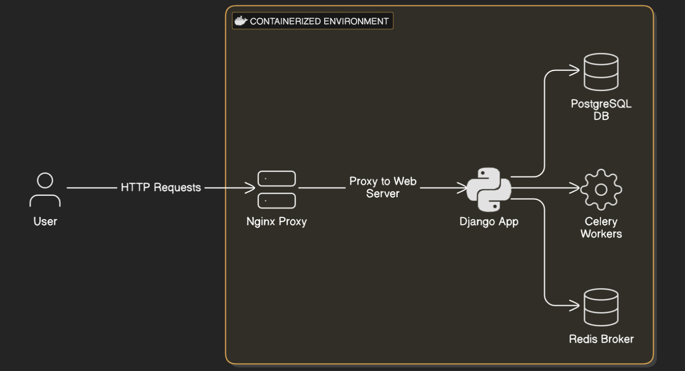

# The Loan Approval System



### System Components:

1. **Django Application**:
   - Contains the core logic for customer and loan management.
   - APIs include endpoints for creating customers, checking loan eligibility, and processing loan creation.

2. **PostgreSQL Database**:
   - Stores customer data, loan records, and all relevant financial information.
   - Ensures data integrity and supports complex queries for loan and credit score calculations.

3. **Celery with Redis**:
   - Celery is used for background task processing, handling data ingestion, and intensive processing like data ingestion from Excel files.
   - Redis acts as the message broker for Celery, ensuring task distribution.

4. **Docker**:
   - Containerizes the Django application, PostgreSQL, Redis, and Celery workers for consistent deployment and easy scaling.

5. **Nginx**:
   - Acts as a reverse proxy server for load balancing and handling incoming HTTP requests to the Django application.

### High-Level Architecture Diagram:

```
[ User ]
   |
   | HTTP Requests
   v
[ Nginx Proxy ]
   |
   | Proxy to Web Server
   v
[ Django App (Web Service) ]
   |        |        |
   |        |        |
   v        v        v
[ PostgreSQL DB ]  [ Celery Workers ]  [ Redis Broker ]
```

### Deployment and Containerization:
- **Docker** is used to containerize the entire application, allowing for easy replication and deployment across different environments.
- **Docker Compose** orchestrates multiple containers (Django, PostgreSQL, Redis, Celery).

### Instructions for Deployment:

1. **Build and Run Containers**:
   - Run `docker-compose up --build` to build and start the containers.

2. **Automated Tasks**:
   - The Django application auto-runs database migrations on startup.
   - Data ingestion tasks for customer and loan data can be triggered automatically with Celery workers.

3. **Testing the Endpoints**:
   - Use Postman or any API client to test the `/register`, `/check-eligibility`, `/create-loan`, `/view-loan/loan_id`,  and `/view-loans/customer_id`.

### Key Considerations:
- **Scalability**: The use of Docker and Celery allows for easy scaling of the web service and background workers.
- **Data Integrity**: PostgreSQL ensures reliable storage and complex query support.
- **Performance**: Redis as a broker for Celery enhances the performance of background task processing.

---

**ReadMe File for the Project**

# Loan Approval System

## Overview
This project is a containerized loan approval system built using Django, PostgreSQL, Redis, and Celery. It allows for creating and managing customer and loan records, checking loan eligibility, and processing loan requests based on custom business rules.

## Features
- Customer and loan management.
- Loan eligibility checking.
- Background data ingestion from Excel files.
- Containerized setup for consistent deployment.

## Installation
1. Clone the repository:
   ```bash
   git clone https://github.com/its-abhishek/the_loan_approval_system.git
   cd credit-approval-system
   ```

2. Build and start containers:
   ```bash
   docker-compose up --build
   ```

3. Access the application at `http://localhost:8000`.

## API Endpoints <small>(req, res)</small>
### 1. **POST /register/**
**Request Body**:
```json
{
    "first_name": "John",
    "last_name": "Doe",
    "phone_number": "9743816791",
    "monthly_income": 50000,
    "age": 35
}
```

**Response**:
```json
{
    "customer_id":301,
    "name":"John Doe",
    "age":35,
    "monthly_income":50000,
    "approved_limit":1800000,
    "phone_number":"9743816791"
}
```

### 2. **POST /check-eligibility/**
**Request Body**:
```json
{
    "customer_id": 1,
    "loan_amount": 100000,
    "interest_rate": 15,
    "tenure": 36
}
```

**Response**:
```json
{
    "customer_id": 1,
    "credit_score": 55,
    "approval": true,
    "interest_rate": 15,
    "corrected_interest_rate": 15,
    "tenure": 36,
    "monthly_installment": 3333
}
```

### 3. **POST /create-loan/**
**Request Body**:
```json
{
    "customer_id": 1,
    "loan_amount": 900000,
    "interest_rate": 17.92,
    "tenure": 138
}
```

**Response**:
```json
{
    "loan_id": 1,
    "customer_id": 1,
    "loan_approved": true,
    "message": "Loan approved",
    "interest_rate": 17.92,
    "corrected_interest_rate": 17.92,
    "tenure": 138,
    "monthly_installment": 7366,
    "start_date": "2024-11-10",
    "end_date": "2036-05-10"
}
```

### 4. **GET /view-loan/loan_id**
**Response**:
```json
{
    "loan_id":101,
    "customer":
    {
        "id":78,
        "first_name":"Alda",
        "last_name":"Gimenez",
        "phone_number":"9167349806",
        "age":null
    },
    "loan_amount":900000.0,
    "interest_rate":13.11,
    "monthly_installment":47977.0,
    "tenure":24
}
```

### 5. **GET /view-loans/customer_id**
**Response**:
```json
[
    {
        "loan_id":446,
        "loan_amount":900000.0,
        "interest_rate":17.92,
        "monthly_installment":39978.0,
        "repayments_left":138
    }
]
```

## Technologies Used
- **Django**: Backend framework.
- **PostgreSQL**: Database.
- **Redis**: Message broker for Celery.
- **Celery**: Background task processing.
- **Docker**: Containerization.
- **Nginx**: Reverse proxy.

## License
This project is licensed under the MIT License.
